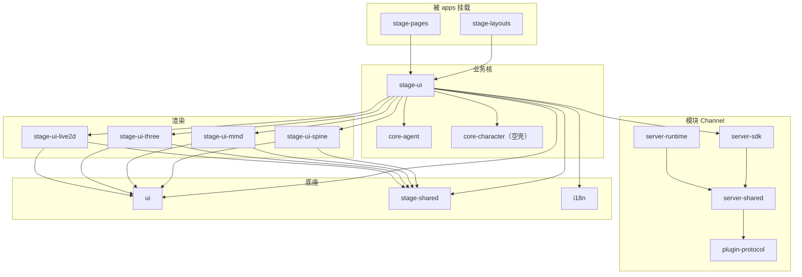

# 共享包图

> **管什么**：`packages/` 分组、频率、分层、「怎么用」、**任务速查 / 最短调用链**、演示入口
> **不管什么**：单包完整 API 手册；`apps/` / `services/` / `plugins/` 产品面深读；CI/Histoire 操作细则 → `工程横切` / `工程工具`

事实以各包 `package.json` 与源码为准（对照 `v0.11.3`）。组内包按**依赖数 → 触及文件**降序。

## 从这里开始

→ [学习路径](./学习路径.md)
→ 速查：[任务速查](./任务速查.md) · [最短调用链](./最短调用链.md)
→ 总表：[包索引总表](./包索引总表.md)
→ 演示：[演示与用例入口](./演示与用例入口.md)（含「要不要单独用例仓」结论）

## 专题

| 文档 | 内容 |
|------|------|
| [学习路径](./学习路径.md) | 按组顺序读 |
| [任务速查](./任务速查.md) | 任务 → 包 → 入口文件 |
| [最短调用链](./最短调用链.md) | A 聊天 · A′ 云同步 · B Channel · C 路由 · D 语音 · E 表现切段 |
| [包索引总表](./包索引总表.md) | 频率排序全表 · Top 15 |
| [频次数据](./频次数据.md) | 扫描脚本与 `_data/freq-latest.json` |
| [演示与用例入口](./演示与用例入口.md) | 公开站 / 本地命令 / 用例仓评估 |
| [Stage壳与共享页](./Stage壳与共享页.md) | §1 `stage-ui` / `shared` / `layouts` / `pages` |
| [渲染与模型驱动](./渲染与模型驱动.md) | §2 `stage-ui-*` · `model-driver-*` |
| [UI原语与字体](./UI原语与字体.md) | §3 `ui` · `font-*` |
| [编排内核与记忆](./编排内核与记忆.md) | §4 `ccc` · `stream-kit` · `core-*` |
| [音频与听写管线](./音频与听写管线.md) | §5 `audio` · `pipelines` |
| [Channel与插件协议](./Channel与插件协议.md) | §6 `server-sdk` / `runtime` · `plugin-*` |
| [云端契约](./云端契约.md) | §7 `schema` · `sdk-shared` |
| [Electron桌面辅包](./Electron桌面辅包.md) | §8 `electron-*` |
| [工程场景与i18n](./工程场景与i18n.md) | §9 `i18n` · `scenarios` · `cap-vite` |
| [迁出占位](./迁出占位.md) | §10 duckdb 迁出 |

## 分层一眼看

只能向下依赖（与 [整体架构](../整体架构.md) 一致）：

```text
apps / services / plugins
  → stage-pages · stage-layouts
    → stage-ui
      → stage-ui-*（渲染）· core-* · audio/pipelines · server-sdk*
        → stage-shared · ui · i18n · stream-kit · ccc · fonts…
```



## 分组速览

| 组 | 代表包（组内频率前排） | 展开 |
|----|------------------------|------|
| Stage 壳 | `stage-ui` · `stage-shared` | [Stage壳与共享页](./Stage壳与共享页.md) |
| 渲染 | `stage-ui-three` · `stage-ui-live2d` | [渲染与模型驱动](./渲染与模型驱动.md) |
| UI / 字体 | `ui` · 主字体 | [UI原语与字体](./UI原语与字体.md) |
| 编排 | `ccc` · `stream-kit` · `core-agent` | [编排内核与记忆](./编排内核与记忆.md) |
| 音频 | `audio` · `pipelines-audio` | [音频与听写管线](./音频与听写管线.md) |
| Channel / 插件 | `server-sdk` · `plugin-sdk` | [Channel与插件协议](./Channel与插件协议.md) |
| 云端契约 | `server-sdk-shared` · `server-schema` | [云端契约](./云端契约.md) |
| Electron | `electron-vueuse` · `electron-eventa` | [Electron桌面辅包](./Electron桌面辅包.md) |
| 工程场景 | `i18n` · scenarios · `cap-vite` | [工程场景与i18n](./工程场景与i18n.md) |
| 迁出占位 | duckdb 目录 | [迁出占位](./迁出占位.md) |

## 刻意不写（本域）

| 项 | 说明 |
|----|------|
| 组件级 API 全表 | `ui` 以 `docs/ai/context/ui-components.md` 为准；Histoire 见 `/ui` |
| catalog 外发 `@proj-airi/*` 深读 | 总表只列名；实现不在本 `packages/` 树 |
| `packages/` 外 workspace | `apps` / `services` / `plugins` / `integrations` |
| 独立外仓用例库 | 评估见 [演示与用例入口](./演示与用例入口.md)；现阶段不建 |
| 频次进 CI | 仅本域脚本 + `_data/`；按需重跑，不挂根脚本 |
