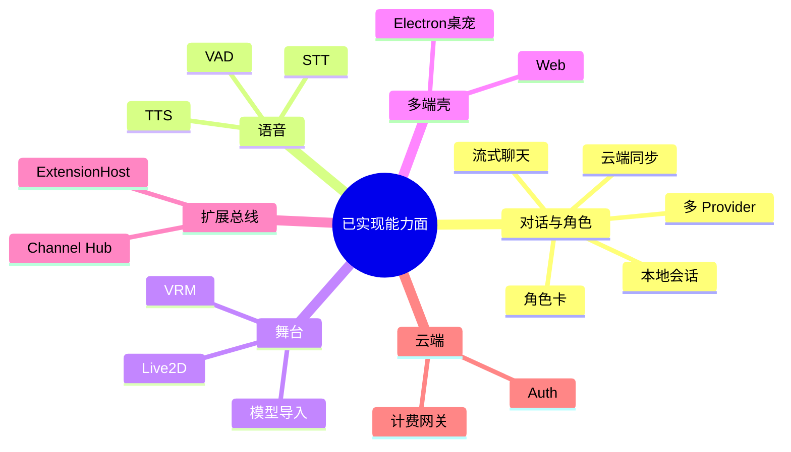

# AIRI 功能地图

> 展示**当前仓库里已经实现（或可源码启用）的功能**，按产品能力归类。
> 架构边界见 [整体架构](./整体架构.md)；阈值 / 队列 / 评分见 [算法主线](./算法主线/)；实现细节进各功能域专题。对照：`v0.11.3`。

## 图例

| 标记 | 含义 |
|------|------|
| 已实现 | 主路径可用，文档与代码对齐 |
| 可启用 | 代码在仓内，需本地配置 / 独立进程 / 实验开关 |
| 进行中 | 有骨架或部分能力，产品面未闭合 |
| 迁移中 | 仍可跑，但标注弃用或正在替换 |

## 1. 对话与角色 — [详解](./角色对话/)

| 功能 | 状态 | 用户侧表现 |
|------|------|------------|
| 流式聊天编排 | 已实现 | 发消息、看流式回复、会话列表 / fork |
| 本地会话持久化 | 已实现 | IndexedDB 保存历史 |
| 云端聊天同步 | 已实现 | 登录后经 `/ws/chat` 同步（依赖云端） |
| 意识模型选型 | 已实现 | 选择 Provider + 模型作为「大脑」 |
| 角色卡（AIRI 扩展） | 已实现 | 导入/导出卡，绑定语音/视觉/展示模型等 |
| Provider 目录 | 已实现 | OpenAI 兼容及多家云 / 本地配置 |
| Web Search（Tavily） | 可启用 | 工具挂到 LLM（需 Key） |
| Artistry 生图 | 可启用 | 须接生图后端（ComfyUI / Replicate / Nano Banana），非聊天 LLM；卡级配置 + 可选电影式自主 |
| 长期记忆（pgvector） | 进行中 | Stage UI WIP；`memory-pgvector` 空壳；Telegram bot 自有向量。见 [长期记忆边界](./角色对话/长期记忆边界.md) |

## 2. 语音交互 — [详解](./语音交互/)

| 功能 | 状态 | 用户侧表现 |
|------|------|------------|
| 说话检测 VAD | 已实现 | 端侧切段，减少空转写 |
| 语音输入 STT | 已实现 | 流式或录音转写后进聊天 |
| 语音输出 TTS | 已实现 | 回复流式合成播放；设置页试听 |
| 共享音频管线 | 已实现 | 播放、chunk、转写缓冲跨端复用 |
| Official / 云端 TTS | 已实现 | 经 `apps/server` 网关（计费面） |
| 本地 Kokoro TTS | 可启用 | 浏览器端侧合成 |
| 云端 STT 完整路由 | 已实现 | Official `POST /api/v1/audio/transcriptions/stream`；见 [语音交互/云端流式转写](./语音交互/云端流式转写.md) |

## 3. 舞台呈现 — [详解](./舞台呈现/)

| 功能 | 状态 | 用户侧表现 |
|------|------|------------|
| Live2D 舞台 | 已实现 | Zip/目录模型展示与交互 |
| VRM / Three 舞台 | 已实现 | 3D 角色展示 |
| 展示模型库管理 | 已实现 | 预设 + 导入多格式 |
| Spine / MMD 导入 | 可启用 | 次路径格式，实验体验 |
| Vision 看屏/看图 | 可启用 | 多模态 Provider + 编排 |
| Lipsync 口型 | 可启用 | 音频驱动口型 |
| MediaPipe 动捕 | 可启用 | Devtools / 驱动包试玩 |
| Godot sidecar | 可启用 | 仅桌面，独立 3D 场景实验 |

## 4. 多端 / 研究线

| 入口 | 说明 |
|------|------|
| [多端应用/网页端](./多端应用/网页端/) | Web（一端一文） |
| [多端应用/桌宠端](./多端应用/桌宠端/) | Electron 桌宠 |
| [多端应用/移动端](./多端应用/移动端/) | Pocket（WIP） |
| [通道机器人](./通道机器人/) | Discord 等 Channel 桥 |
| [独立Agent](./独立Agent/) | Telegram / Satori |
| [本机操控](./本机操控/) | computer-use MCP |

### 多端应用壳 — [索引](./多端应用/)

| 功能 | 状态 | 用户侧表现 |
|------|------|------------|
| Web 舞台 | 已实现 | 见 [网页端](./多端应用/网页端/) |
| Electron 桌宠 | 已实现 | 见 [桌宠端](./多端应用/桌宠端/) |
| 点击穿透 / 悬停控制 | 已实现 | 桌宠端文档 |
| 共享设置页 / 布局 | 已实现 | [共享页面布局](./多端应用/共享页面布局.md) |
| Capacitor 移动端 | 进行中 | [移动端](./多端应用/移动端/) |
| 鉴权配套 UI | 已实现 | `apps/ui-server-auth`；见 [云端服务/鉴权界面](./云端服务/鉴权界面.md) |

### 世界接入 — [索引](./世界接入/) · [通道机器人](./通道机器人/) · [独立Agent](./独立Agent/) · [本机操控](./本机操控/)

| 功能 | 状态 | 用户侧表现 |
|------|------|------------|
| Discord 桥 | 可启用 | 见通道机器人 |
| Telegram / Satori | 可启用 | 见独立Agent |
| computer-use MCP | 可启用 | 见 [本机操控](./本机操控/)（偏 macOS + 桌宠） |
| Twitter / X | 可启用 | Playwright + Channel/MCP |
| 浏览器扩展 / VS Code | 可启用 | 上下文推 Channel |
| Minecraft | 迁移中 | Mineflayer 弃用 → Fabric/NeoForge；背景见 [世界接入/Minecraft迁移背景](./世界接入/Minecraft迁移背景.md) |
| Factorio / HA / Bilibili | 进行中 | WIP |

## 5. 插件扩展 — [详解](./插件扩展/)

| 功能 | 状态 | 用户侧表现 |
|------|------|------------|
| 模块 Channel Hub | 已实现 | 桌面内嵌或 `pnpm dev:server` |
| server-sdk 客户端 | 已实现 | 外部进程 announce / 收发事件 |
| ExtensionHost | 已实现（基建） | 桌面加载/启用扩展清单 |
| Kits（widget / gamelet） | 可启用 | 扩展作者式 API |
| 象棋 Gamelet 样例 | 可启用 | Host 型插件示例 |
| 协议包 plugin-protocol | 已实现 | 事件名与 payload 契约 |

## 6. 云端服务 — [详解](./云端服务/)

| 功能 | 状态 | 用户侧表现 |
|------|------|------------|
| Auth / OIDC / Electron 回调 | 已实现 | 登录与桌面回调 |
| Characters / Providers CRUD | 已实现 | 云端角色与提供商配置 |
| Chat REST + WS 同步 | 已实现 | 多端消息同步 |
| OpenAI 兼容 LLM/TTS 网关 | 已实现 | Official 路由与计费挂钩 |
| Flux / Stripe | 已实现 | 额度与支付 |
| Admin 面 | 已实现 | 运维发放、目录、配置等 |

## 7. 工程工具 — [详解](./工程工具/)

| 功能 | 状态 | 开发侧表现 |
|------|------|------------|
| Histoire 组件故事 | 已实现 | `pnpm dev:ui` |
| 各端 Devtools 页 | 可启用 | 音频 / 动捕 / 窗口等调试 |
| Scenarios + Vishot | 可启用 | 桌宠场景截图 |
| docs/solutions | 已实现 | 踩坑与修复记录 |

## 域索引

| 域 | 目录 |
|----|------|
| 算法主线 | [./算法主线/](./算法主线/) |
| 角色对话 | [./角色对话/](./角色对话/) |
| 语音交互 | [./语音交互/](./语音交互/) |
| 舞台呈现 | [./舞台呈现/](./舞台呈现/) |
| 多端应用 | [./多端应用/](./多端应用/) |
| 界面设计 | [./界面设计/](./界面设计/) |
| 世界接入 | [./世界接入/](./世界接入/) |
| 本机操控 | [./本机操控/](./本机操控/) |
| 通道机器人 | [./通道机器人/](./通道机器人/) |
| 独立Agent | [./独立Agent/](./独立Agent/) |
| 插件扩展 | [./插件扩展/](./插件扩展/) |
| 云端服务 | [./云端服务/](./云端服务/) |
| 工程横切 | [./工程横切/](./工程横切/) |
| 工程工具 | [./工程工具/](./工程工具/) |
