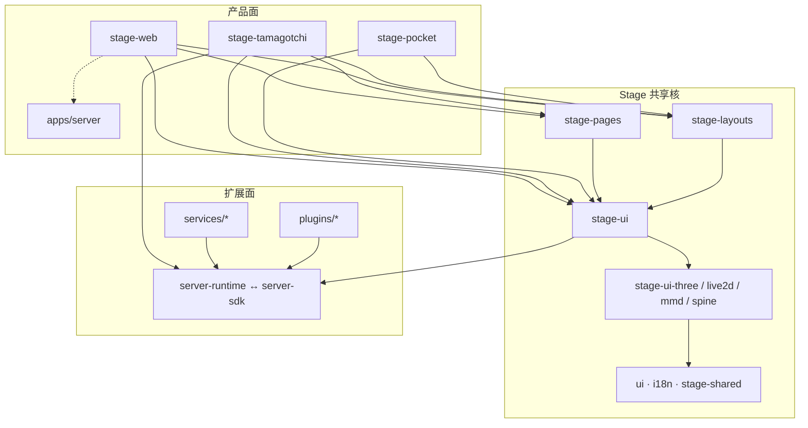

# AIRI 整体架构

> 只讲**结构与边界**。已实现功能清单见 [功能地图](./功能地图.md)；决策链与阈值见 [算法主线](./算法主线/)；各域细节见对应子目录。
> 对照：`v0.11.3` · `AGENTS.md`

## 定位

AIRI 是「LLM 虚拟角色 / 数字生命容器」的 **pnpm Monorepo**（包名 scope `@proj-airi`）：多端舞台共用一套 Stage 业务核，桌面用 Electron 做宿主，外部能力经 **模块 Channel** 或 **MCP** 接入，另有独立 **云端 API**。产品愿景见 [项目介绍](./项目介绍.md)。

## 顶层目录

| 目录 | 角色 |
|------|------|
| `apps/` | 可运行产品壳（Web / Electron / Capacitor / 云端 API 等） |
| `packages/` | 可复用库（Stage UI、布局页面、SDK、渲染、音频…） |
| `services/` | 独立进程能力（机器人、MCP、游戏 Agent 等） |
| `plugins/` | Channel 插件或桌面 ExtensionHost 扩展 |
| `engines/` | 渲染 sidecar（Godot） |
| `integrations/` | 外部 IDE 集成（VS Code） |
| `docs/` | VitePress 与 solutions / AI context |

工作区：`pnpm-workspace.yaml`（含 catalog）。任务编排：Turbo。



## 依赖分层（硬约束）

只能向下依赖，禁止成环：

```text
apps（端壳）
  → stage-pages / stage-layouts
    → stage-ui（业务编排）
      → stage-ui-*（渲染，不反向依赖 stage-ui）
        → stage-shared · ui · i18n
```

| 包 | 边界 |
|----|------|
| `ui` | 原语；禁止依赖 `stage-*` |
| `stage-shared` | 跨端小工具；不依赖 `stage-ui` |
| `stage-ui-*` | 渲染；不依赖 pages/layouts |
| `stage-ui` | 业务核；不依赖 pages/layouts |
| `stage-pages` / `stage-layouts` | 消费 stage-ui，被 apps 挂载 |

## 产品面入口

| App | 路径 | 运行时 |
|-----|------|--------|
| stage-web | `apps/stage-web/src/main.ts` | Vite + Vue |
| stage-tamagotchi | Main `…/main/index.ts` · Renderer `…/renderer/main.ts` | Electron + electron-vite |
| stage-pocket | `apps/stage-pocket/src/main.ts` | Capacitor |
| server | `apps/server/src/app.ts` | Hono |

桌面 IPC：**@moeru/eventa**（契约在 `apps/stage-tamagotchi/src/shared`）。主进程装配：**injeca**。

路由：各端 Vite/`electron.vite` 用 `routesFolder` 合并本端 `pages` + `packages/stage-pages`；布局用 `layoutsDirs` 指向 `packages/stage-layouts`（桌面可本地覆盖）。

## 两套服务端（架构级易混点）

| 通道 | 实现 | 职责 |
|------|------|------|
| **云端 API** | `apps/server` + `server-schema` + `server-sdk-shared` | 账号、同步、计费、LLM/TTS 网关 |
| **模块 Channel** | `server-runtime` ↔ `server-sdk`（契约：`server-shared` ← `plugin-protocol`） | 本机/局域网模块事件总线 |

二者正交：可只跑本地 Stage、不启云端。根脚本 `pnpm dev:server` 启的是 **Channel（server-runtime）**，不是 `apps/server`。

MCP（如 `computer-use-mcp`）走 stdio，不经 Channel 主链 → 学习域 [本机操控](./本机操控/)。

## 扩展挂载面

| 方式 | 宿主 | 典型消费者 |
|------|------|------------|
| Channel Client | 桌面内嵌 Hub / 独立 `server-runtime` | services、部分 plugins、Stage channel store |
| ExtensionHost + kits | 桌面 `…/services/airi/plugins` | gamelet（如象棋） |
| Godot WS | 桌面 godot-stage | 仅渲染 sidecar |

## 工程骨架

| 项 | 选择 |
|----|------|
| 包管理 | pnpm workspaces + catalog |
| 构建 | Turbo + Vite / electron-vite / tsdown |
| 桌面 | Electron（非 Tauri / 无 `crates/`） |
| 样式 | UnoCSS（根 `uno.config.ts`） |
| 校验 | Valibot 为主，兼 Zod |
| 质量 | moeru-lint、oxlint、Vitest、Histoire |

技术明细见 [技术栈备忘](./技术栈备忘.md)。

## 算法主线（横切）

包与端壳回答「代码在哪」；阈值、队列、评分回答「何时做什么」。
从 [算法主线/端到端闭环](./算法主线/端到端闭环.md) 进入，再下钻切段、编排、Agent 调度、记忆、口型。

## 路径速查

```text
apps/stage-web|tamagotchi|pocket|server
packages/stage-ui|stage-pages|stage-layouts|ui|i18n|stage-shared
packages/server-runtime|server-sdk|server-shared|plugin-protocol|plugin-sdk
packages/stage-ui-live2d|stage-ui-three|stage-ui-mmd|stage-ui-spine
```

`packages/` **全量分组与主消费者** → [共享包图](./共享包图/)。
