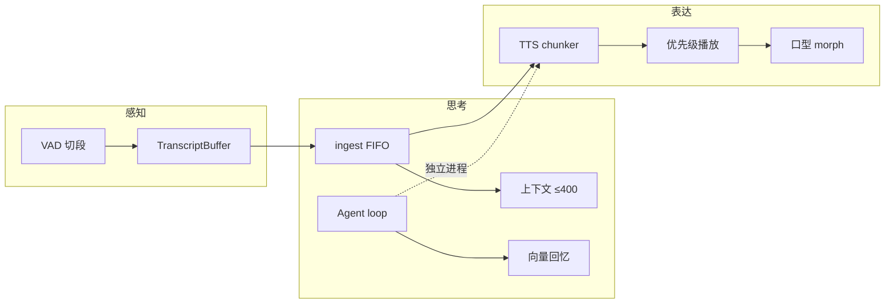

# 端到端闭环

> 算法主轴：一次「说完 → 想完 → 说回去」里，各域决策按什么顺序咬合。
> 实现入口仍在功能域；本篇只画**决策顺序**与交叉点。

## 产品主轴（Stage）

```text
麦音频
  → [切段] Silero VAD（说话起止）
  → STT
  → [缓冲] TranscriptBuffer（碎片合成一句）
  → [编排] ingest → FIFO 队列 → compose → LLM stream
  → [播控] SpeechPipeline：TTS chunker → 优先级播放
  → [口型] volume × vowel morph → Live2D/VRM
```

| 步 | 算法专题 | 功能域 |
|----|----------|--------|
| 切段 | [切段与播控](./切段与播控.md) | [听力转写](../语音交互/听力转写.md) |
| 缓冲 | 同上 | [音频管线](../语音交互/音频管线.md) |
| 编排 | [编排与上下文](./编排与上下文.md) | [聊天编排](../角色对话/聊天编排.md) |
| 播控 | [切段与播控](./切段与播控.md) | [语音合成](../语音交互/语音合成.md) |
| 口型 | [口型驱动](./口型驱动.md) | [Live2D与VRM](../舞台呈现/Live2D与VRM.md) |

Web 文本输入可跳过切段/缓冲，直接从 `ingest` 进入编排；TTS/口型仍挂在 Stage 钩子上。见 [聊天与语音路径](../多端应用/网页端/聊天与语音路径.md)。

## 旁路 A：Channel 机器人

```text
Discord 等外部消息
  → Channel 事件
  → context-bridge（input:text）
  → 同一套 ingest / 编排 /（可选）TTS
  → output:gen-ai:chat:* 回桥
```

**不**另起 Agent loop；大脑仍是 Stage 聊天编排。
细节：[Discord竖切](../通道机器人/Discord竖切.md) · [Channel事件速查](../通道机器人/Channel事件速查.md)。

## 旁路 B：独立 Agent

```text
平台消息
  → 未读池（截断）
  → [调度] arrival 立即跑 / 周期 tick
  → imagineAnAction（JSON Action）
  → read_unread →（Telegram）[记忆检索]
  → send_message / sleep / break …
```

与 Stage 主轴**并行存在**：独立进程自带 LLM loop，不经 `ingest`。
细节：[Agent调度](./Agent调度.md) · [记忆检索](./记忆检索.md) · [对照总览](../独立Agent/对照总览.md)。

## 一张对照图



| 问题类型 | 先看 |
|----------|------|
| 话说完很久才进输入框 / 聊天 | 切段阈值 · 缓冲 delay |
| 连发消息顺序乱或旧回复冒出来 | 编排 FIFO · generation |
| Bot 不回或回太慢 | Agent 调度 · 未读截断 |
| 回忆文不对题 | 记忆检索分数与 Top-K |
| 嘴张合怪 / 抖 | 口型公式与平滑窗 |

## 阅读顺序

1. 本篇建立主轴
2. 按上表进专题
3. 回功能域学习路径跟源码
